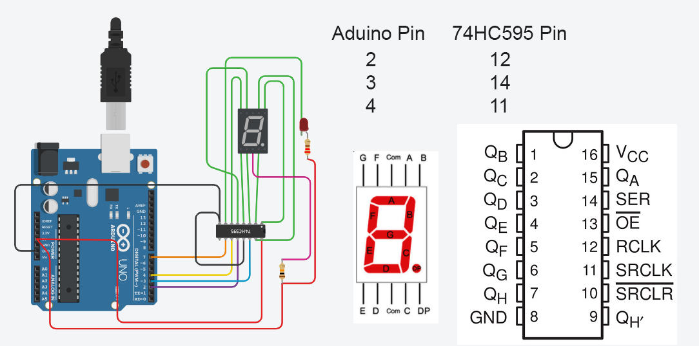

# Extend-GPIO-of-Microcontroller
Microcontroller like ATMEGA (AVR), PIC etc. GPIO pin extend with Shift Register 74HC595.

---------------------------------------------------------------------------------------------

## Parts List


## Circuit Diagram


## Output pin byet code calculation chart


## Codes are: 
```

int latchPin = 2;     // ArduinoPin-2 to 74HC595Pin-12 
int dataPin =3;      // ArduinoPin-3 to 74HC595Pin-14
int clockPin = 4;    // ArduinoPin-4 to 74HC595Pin-11 
int rst = 7;         // ArduinoPin-7 to 74HC595Pin-10 

bool l[8];           //Output Pin State(One Shift Register 8 pin.)
int send_value = 0;  //Sending this value to 595.

void setup()
{

  Serial.begin(9600);
  pinMode(latchPin, OUTPUT);
  pinMode(dataPin, OUTPUT);
  pinMode(clockPin, OUTPUT);
  pinMode(rst, OUTPUT);
  
  for(int i=0; i < 8; i++){
    l[i] = false;       //all state set to false/off
  }
  
  //Reset 595
  digitalWrite(rst, LOW);
  digitalWrite(rst, HIGH);
  
  //For LOW all Output
  digitalWrite(latchPin, LOW);
  shiftOut(dataPin,clockPin,MSBFIRST,255);
  digitalWrite(latchPin, HIGH);
  delay(500);
  
  Serial.println("Start Working Mode");
}

void loop()
{

  Serial.println(send_value);
  
  if(Serial.available()){
  
    int val = Serial.parseInt();
    Serial.print(val);
    
    if(val == 1){    //input 1 for turn on/HIGH output pin 1
    
      if(l[0] == false){
      l[0] = true;
      Serial.print("loop1");
      switchDo();
      }else{             //Again input 1 (toggle work) for trun off/LOW output pin 1
      	l[0] = false;
        switchDo();
      }
    }else if(val == 2){  //input 2 for turn on/HIGH output pin 2
    
      if(l[1] == false){
      l[1] = true;
      Serial.print("loop5");
      switchDo();
      }else{              //Again input 2 (toggle work) for trun off/LOW output pin 2
        l[1] = false;
        switchDo();
      }
    }else if(val == 3){
    
      if(l[2] == false){
      l[2] = true;
      Serial.print("loop5");
      switchDo();
      }else{
        l[2] = false;
        switchDo();
      }
    }else if(val == 4){
    
      if(l[3] == false){
      l[3] = true;
      Serial.print("loop5");
      switchDo();
      }else{
        l[3] = false;
        switchDo();
      }
    }else if(val == 5){
    
      if(l[4] == false){
      l[4] = true;
      Serial.print("loop5");
      switchDo();
      }else{
        l[4] = false;
        switchDo();
      }
    }else if(val == 6){
    
      if(l[5] == false){
      l[5] = true;
      Serial.print("loop5");
      switchDo();
      }else{
        l[5] = false;
        switchDo();
      }
    }else if(val == 7){
    
      if(l[6] == false){
      l[6] = true;
      Serial.print("loop5");
      switchDo();
      }else{
        l[6] = false;
        switchDo();
      }
    }else if(val == 8){
    
      if(l[7] == false){
      l[7] = true;
      Serial.print("loop5");
      switchDo();
      }else{
        l[7] = false;
        switchDo();
      }
    }
  }
}

void check(){           //check Which pin are ON/HIGH

  int present = 0;

  for(int i = 0; i < 8; i++){
    
    if(l[i] == true){
    Serial.print("li");
      if(i == 0){
      	 present = present + 1;  //if on/HIGH  it added byet for specific output pin. (Ex: pin1: 1, pin2:2, pin3:4, pin4:8)
      }else if(i == 1){
         present = present + 2;
      }else if(i == 2){
         present = present + 4;
      }else if(i == 3){
         present = present + 8;
      }else if(i == 4){
         present = present + 16;
      }else if(i == 5){
         present = present + 32;
      }else if(i == 6){
         present = present + 64;
      }else if(i == 7){
         present = present + 128;
      }
    }
    send_value = present;
  }
}

void switchDo(){
  check();
  int state = 255-send_value;  //255 is the total 8bit decimal output pin value.
  digitalWrite(latchPin, LOW);
  shiftOut(dataPin,clockPin,MSBFIRST,state);     //turn HIGH/LOW or ON/OFF output pin of 595 by sending state code
  digitalWrite(latchPin, HIGH);
  delay(500);

}


```

## NB: Connect 13 Pin of 595 to GND for active IC.
